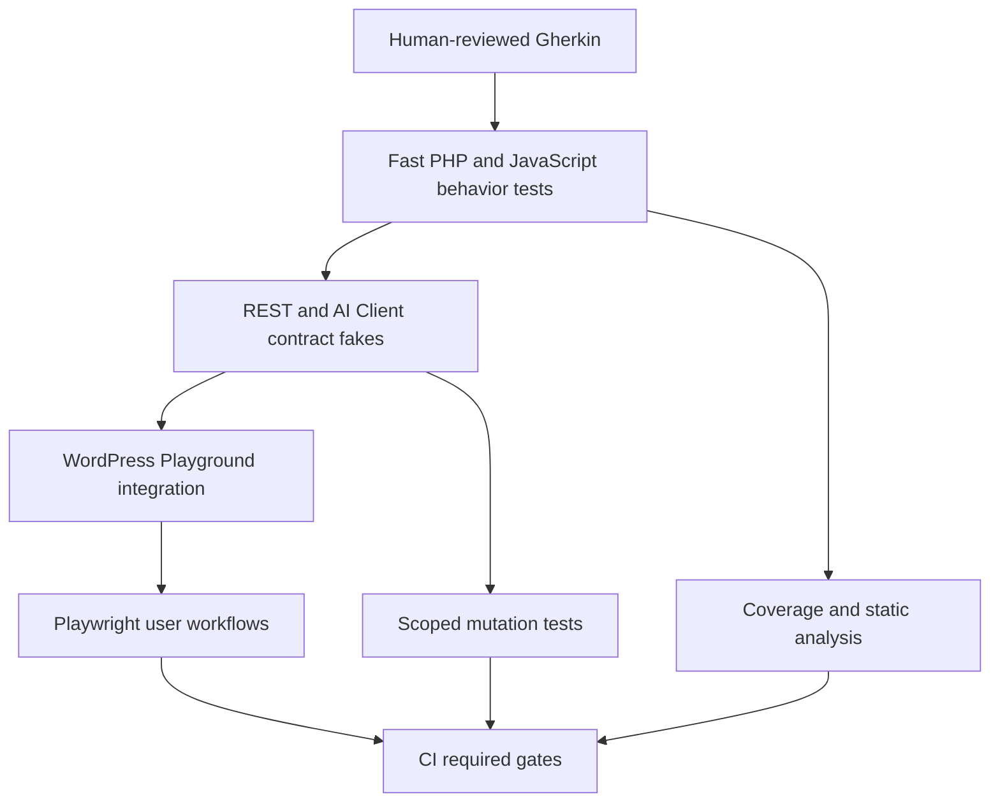
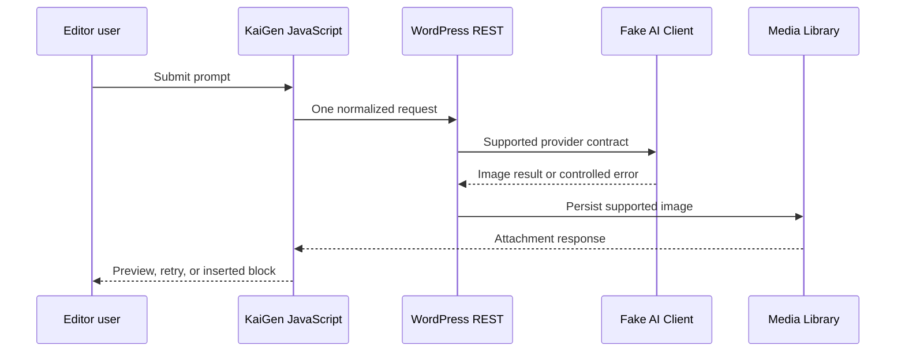

# Independent Verification Layers

## Goal Capsule

- **Objective:** Make AI-authored KaiGen changes earn confidence from independent specification, unit, contract, browser, and quality-signal layers.
- **Authority:** The repository's current WordPress AI Client architecture and user-visible behavior outrank generic testing recommendations.
- **Execution profile:** Characterization-first for legacy seams; proof-first when a new test exposes a defect.
- **Stop conditions:** Do not invent billing, credits, Stripe, Cloudflare, Replicate, async callbacks, or generation-history behavior that is absent from this repository.
- **Tail ownership:** The orchestrator integrates subagent work, runs authoritative verification, and reports any expensive or environment-dependent gates separately.

---

## Product Contract

### Summary

KaiGen needs a test pyramid whose layers fail for different reasons. Human-readable acceptance scenarios define the product; executable PHP and JavaScript tests protect business and boundary behavior; deterministic WordPress Playground tests protect real editor workflows; CI, coverage, static analysis, and mutation testing measure whether those tests constrain future changes.

### Problem Frame

The current suite contains useful JavaScript and Playwright foundations, but much of the UI and all PHP coverage inspects source text rather than executing behavior. CI runs lint and only the base Playwright scenario, leaving JavaScript unit tests, PHPUnit, launcher tests, mocked generation, reference media, premium tests, build parity, coverage, and mutation signals outside the pull-request gate. A coding agent can therefore produce a green change while breaking important runtime contracts.

### Requirements

#### Specification and architecture

- R1. Human-reviewed acceptance scenarios must describe KaiGen's real workflows and failure states without allowing implementation details to define expected behavior.
- R2. Test seams must follow dependency direction: core policy is tested without WordPress, boundary adapters are tested with deterministic fakes, and browser tests exercise the assembled plugin.
- R3. Generic recommendations for systems absent from KaiGen must remain out of scope until those systems enter the repository.

#### Executable behavior

- R4. PHP tests must execute request validation, permission decisions, timeout retry ownership, hook cleanup, provider support failures, result extraction, and media-boundary behavior rather than match source strings.
- R5. JavaScript tests must execute API normalization, single-flight generation, loading/error recovery, stale refinement handling, progress behavior, and editor insertion behavior.
- R6. Contract fixtures must model the supported WordPress AI Client result shapes and REST request/response shapes without making live paid provider calls in the fast suite.
- R7. Playwright must cover successful generation, failure and retry, duplicate submission prevention, request payloads, Media Library insertion, reference-image persistence, browser errors, keyboard behavior, and responsive layout where KaiGen owns the UI.
- R8. Premium image-agent orchestration must be included intentionally in root verification rather than discovered accidentally through dependency hoisting.

#### Independent quality signals

- R9. Pull requests must run all existing fast suites, all deterministic E2E scenarios, and committed-build parity.
- R10. Coverage must establish a ratcheting floor on behavior-bearing modules without rewarding source-text assertions.
- R11. Static analysis and mutation testing must be scoped to critical PHP policy and boundary code, with expensive mutation runs separated from the fast default suite.
- R12. Test and browser failure artifacts must be retained sufficiently to diagnose failures.

### Acceptance Examples

- AE1. Given a valid prompt and a supported fake provider, when generation succeeds, then exactly one request is observed and the returned attachment becomes the image block's persisted media.
- AE2. Given the deterministic provider returns an error, when generation fails, then the modal announces the failure, preserves the prompt, re-enables submission, and a later retry can succeed.
- AE3. Given generation is already pending, when the user presses Enter or clicks repeatedly, then KaiGen sends only one generation request.
- AE4. Given a user lacks `upload_files`, when a KaiGen REST route is requested, then WordPress denies access.
- AE5. Given a reference attachment the user cannot edit, when generation is requested with its ID, then KaiGen rejects the reference before provider execution.
- AE6. Given the first provider call fails with a timeout-like error, when KaiGen retries, then lower-level timeout options apply only to the retry and all hooks are removed afterward.
- AE7. Given a non-timeout provider failure, when generation fails, then KaiGen does not retry.
- AE8. Given malformed, missing, inline, URL, snake-case, or camel-case image results, when the service adapts them, then supported shapes normalize and unsupported shapes return stable errors.
- AE9. Given any pull request, when CI runs, then root unit, PHP, launcher, premium unit, build-parity, and all deterministic E2E suites are intentional gates.
- AE10. Given a conditional in critical retry, permission, or normalization logic is mutated, when the mutation suite runs, then the relevant behavioral test fails.

### Scope Boundaries

In scope:

- Base plugin PHP, JavaScript, WordPress REST/media, deterministic WordPress Playground workflows, premium JavaScript orchestration, and repository CI.
- Testability refactors or narrow defect fixes discovered by proof-first tests when required to expose observable behavior.

Deferred to follow-up work:

- Live provider compatibility smoke tests, because they require credentials, cost controls, and a quarantined schedule.
- Full WordPress/PHP version matrices and Firefox/WebKit lanes after the deterministic Chromium gate is stable.
- Broad mutation testing of WordPress glue and JSX; initial mutation scope stays on critical policy.

Outside this product's current identity:

- Credits, pricing, billing, refunds, Stripe webhooks, Cloudflare KV, Replicate callbacks, generation ledgers, and account-level idempotency.

---

## Planning Contract

### Key Technical Decisions

- KTD1. **Use concentric verification rings.** Acceptance text defines intent; pure unit tests protect policy; boundary tests protect REST/AI Client/media contracts; Playwright protects assembled workflows; coverage and mutation test the strength of the earlier rings.
- KTD2. **Prefer deterministic fakes to live providers.** The fast suite owns KaiGen's contract with the WordPress AI Client, not third-party provider internals or paid service uptime.
- KTD3. **Replace source inspection with execution incrementally.** Existing source-string tests may remain only as temporary architecture guards; new confidence must come from observable behavior.
- KTD4. **Use WordPress Playground as the integration environment.** It already provides real REST, roles, media persistence, and editor behavior without introducing a separate database harness. The provider fake must live at the AI Client boundary so production REST callbacks, services, and media handling still execute.
- KTD5. **Make CI gates explicit.** Root scripts name base and premium suites directly so worktrees, dependency hoisting, and Jest discovery cannot silently change the test set.
- KTD6. **Ratcheting beats vanity thresholds.** Initial coverage and mutation floors record a truthful baseline on critical modules and may only move upward as structural tests are replaced.

### High-Level Technical Design

### Assumptions

- The current feature branch remains the implementation workspace; unrelated `.worktrees/` content is preserved and excluded from test discovery.
- Composer and npm dependencies already installed locally remain usable; new optional quality tools may require a lockfile update.
- Gherkin scenarios begin as reviewed executable specifications for humans; they do not require a Behat runtime until reusable step definitions justify that dependency.

### Sequencing

U1, U2, and U3 may begin independently: product specification, PHP characterization, and JavaScript characterization do not share write surfaces. U4 and U5 build browser and premium coverage after the executable seams exist. U6 makes the fast suites mandatory. U7 adds static analysis and coverage after behavioral evidence exists. U8 adds the scheduled mutation signal. U9 wires the final measurement gates without reopening earlier CI ownership.

---

## Implementation Units

### U1. Define executable product specifications

- **Goal:** Record the real KaiGen acceptance contract and test-layer ownership.
- **Requirements:** R1, R2, R3
- **Dependencies:** None
- **Files:** `docs/testing/README.md`, `docs/testing/features/image-generation.feature`, `docs/testing/features/reference-images.feature`, `docs/testing/features/prompt-refinement.feature`, `docs/testing/features/premium-image-agent.feature`
- **Approach:** Write concise Gherkin scenarios for happy paths, permissions, provider failures, retry ownership, duplicate submission, malformed results, media persistence, and premium partial completion. Map each scenario to its owning executable layer.
- **Execution note:** Treat the supplied recommendations as input, but remove scenarios for systems absent from the repository.
- **Patterns to follow:** `tests/AGENTS.md`, existing user terminology in `tests/e2e/image-generation.spec.ts`
- **Test scenarios:**
  - Covers AE1-AE10 through named scenarios with observable Given/When/Then outcomes.
  - Every scenario names one owning suite so the specification cannot become an untracked wish list.
- **Verification:** A reviewer can trace every in-scope requirement to at least one feature scenario and one executable layer.

### U2. Execute PHP policy and boundary behavior

- **Goal:** Replace PHP source-text confidence with deterministic executable characterization.
- **Requirements:** R4, R6
- **Dependencies:** None
- **Files:** `inc/class-image-generation-service.php`, `inc/class-image-generation-http-options.php`, `inc/class-image-handler.php`, `inc/class-prompt-refinement-service.php`, `inc/class-rest-api.php`, `tests/php/bootstrap.php`, `tests/php/Support/WordPressStubs.php`, `tests/php/ImageGenerationHttpOptionsTest.php`, `tests/php/ImageGenerationServiceTest.php`, `tests/php/PromptRefinementServiceTest.php`, `tests/php/RestApiTest.php`, `tests/php/TimeoutHandlingTest.php`, `phpunit.xml.dist`
- **Approach:** Introduce only the constructor-injected factories/gateways needed to execute service policy without WordPress, provide a resettable WordPress/AI Client fake boundary, load production classes, and assert public behavior and collaborator calls. Keep Core REST schema/status behavior out of the handwritten stubs; U4 proves that through real Playground dispatch. Retain source guards only where they enforce a deliberate dependency boundary that cannot be observed at runtime.
- **Execution note:** Characterize current behavior first; if a failing test exposes a security leak or cleanup defect, make the smallest production change and preserve it with proof.
- **Patterns to follow:** Namespaced services in `inc/`, PHPUnit 10 conventions, WordPress error/status shapes
- **Test scenarios:**
  - The capability policy returns false without `upload_files` and true for a capable user; U4 proves WordPress converts it to the correct REST denial.
  - Covers AE5. Invalid, missing, and forbidden reference attachment IDs never reach provider generation.
  - Covers AE6. A timeout-like error retries once with temporary HTTP hooks and cleans every hook after success or failure.
  - Covers AE7. A non-timeout error is returned or thrown without retry.
  - Covers AE8. Supported result shapes normalize; missing/unsupported files return stable errors.
  - Empty prompts, unavailable AI Client, unsupported generation, malformed refinement JSON, and thrown provider failures return stable WordPress errors.
- **Verification:** PHPUnit executes production methods and records fake boundary calls; the suite passes without network or WordPress installation.

### U3. Protect JavaScript runtime behavior

- **Goal:** Add behavioral tests for client normalization, single-flight UI state, progress, and stale async results.
- **Requirements:** R5, R10
- **Dependencies:** None
- **Files:** `jest.config.js`, `package.json`, `package-lock.json`, `src/components/GenerateImageModal.js`, `src/filters/addBlockEditFilter.js`, `tests/unit/api.test.js`, `tests/unit/GenerateImageModal.behavior.test.js`, `tests/unit/addBlockEditFilter.behavior.test.js`, `tests/unit/useGenerationProgress.test.js`, `tests/unit/mediaUtils.test.js`
- **Approach:** Extend the WordPress Scripts Jest configuration rather than replacing its transforms, add the explicit render/user-event dependencies required by behavioral component tests, isolate Jest from `.worktrees/`, and use fake timers plus controllable promises. Coverage configuration and thresholds belong only to U7.
- **Execution note:** Add the duplicate-submit test first. If Enter can bypass button disablement, fix the production single-flight guard before expanding the test.
- **Patterns to follow:** Existing `tests/unit/api.test.js`, WordPress Jest environment, public component roles and labels
- **Test scenarios:**
  - Covers AE2. A rejected request announces the error, retains input, and permits a successful retry.
  - Covers AE3. Rapid click/Enter paths call `generateImage` and `onSelect` at most once per active request.
  - Blank/whitespace prompts do not submit; Shift+Enter edits while Enter submits once.
  - Stale refinement promises cannot replace results for a newer prompt.
  - Progress resets when inactive, never regresses, caps at 99, and cleans its interval.
  - Generated media updates the intended core image block with its ID, URL, and prompt-derived alt text exactly once.
  - Jest discovery ignores `.worktrees/` and intentionally includes or excludes premium through named scripts.
- **Verification:** Focused Jest tests pass and worktree duplicates disappear.

### U4. Prove deterministic browser resilience and contracts

- **Goal:** Exercise the assembled editor, REST, fake provider, and Media Library across success and recovery flows.
- **Requirements:** R6, R7, R12
- **Dependencies:** U2, U3
- **Files:** `tests/e2e/fixtures/mu-plugins/kaigen-e2e-generation-mock.php`, `tests/e2e/fixtures/mu-plugins/kaigen-e2e-ai-client.php`, `.github/blueprints/e2e-generation-mocked.json`, `tests/e2e/generation-resilience.spec.ts`, `tests/e2e/generation-contract.spec.ts`, `tests/e2e/support/console-guard.ts`, `tests/e2e/image-generation.spec.ts`, `playwright.config.ts`
- **Approach:** Move generation behavior from the existing `rest_pre_dispatch` shortcut to an AI Client/provider fake so production route callbacks, generation service, result normalization, and media handler execute. Add per-test reset/correlation controls for deterministic request counts. Assert public REST payloads and durable editor/media state. Retain traces on failure and configure both GitHub and artifact-producing reporters.
- **Execution note:** Start from the unused `force-error` fixture path and a red duplicate-submit test.
- **Patterns to follow:** Existing editor harness and blueprint selection in `tests/e2e/image-generation.spec.ts`
- **Test scenarios:**
  - Covers AE1. Successful generation yields exactly one request, one attachment, and matching block attributes.
  - Covers AE2. Forced failure is announced; the modal and prompt remain; retry succeeds.
  - Covers AE3. A delayed request plus repeated click/Enter creates one request and one attachment.
  - Covers AE4. Real WordPress REST dispatch denies a low-capability user with the expected status and permits an uploader.
  - Provider, orientation, prompt, and reference IDs match the REST payload contract exactly.
  - KaiGen-owned browser `pageerror` and unexpected `console.error` messages fail the scenario with diagnostic attachments.
  - Keyboard and mobile checks keep modal actions reachable and state labels accessible.
- **Verification:** Mocked generation and resilience suites pass against WordPress Playground with no external provider calls.

### U5. Include premium orchestration deliberately

- **Goal:** Make premium policy tests and representative browser flow explicit root-owned evidence.
- **Requirements:** R8, R9
- **Dependencies:** U3, U4
- **Files:** `package.json`, `playwright.premium.config.ts`, `.github/blueprints/e2e-premium-generation.json`, `premium/kaigen-premium/package.json`, `premium/kaigen-premium/tests/unit/packageRunner.test.js`, `premium/kaigen-premium/tests/e2e/image-agent.spec.ts`
- **Approach:** Add root scripts that run premium commands via `--prefix`, add a dedicated Playwright configuration and blueprint that activate both plugins, and make one deterministic premium image-agent workflow a required pull-request gate.
- **Execution note:** Do not convert the repository to npm workspaces unless dependency resolution proves that change necessary.
- **Patterns to follow:** Existing premium package scripts and package-runner tests
- **Test scenarios:**
  - A partially completed package preserves inserted assets when a later image fails.
  - Rate-limit exhaustion stops further requests without removing completed assets.
  - Provider rotation does not create duplicate insertion.
  - The deterministic premium browser flow generates and inserts a representative article package with both plugins active.
  - Root verification fails when a premium unit test fails.
- **Verification:** Premium unit and deterministic E2E tests run through explicit root commands and no longer depend on accidental Jest discovery.

### U6. Make all fast and deterministic evidence mandatory

- **Goal:** Turn the existing and new suites into clear pull-request gates.
- **Requirements:** R9, R12
- **Dependencies:** U2, U3, U4, U5
- **Files:** `package.json`, `.github/workflows/lint.yml`, `.github/workflows/playwright.yml`, `.github/workflows/tests.yml`, `.gitignore`
- **Approach:** Add aggregate fast verification, run PHP/JS/launcher/premium tests in CI, run all deterministic E2E blueprints including premium, build both plugins, fail on stale committed artifacts, retain Playwright traces, and upload both `tests/test-results/` and the configured browser report.
- **Execution note:** This is configuration-heavy; prove scripts locally before relying on workflow syntax.
- **Patterns to follow:** Existing least-privilege workflow permissions and one-worker Playground rule
- **Test scenarios:**
  - A pull request changing only JavaScript still runs JavaScript unit tests and build parity.
  - A PHP change runs PHPUnit and PHPCS.
  - Mocked generation and reference scenarios are no longer excluded from CI.
  - Launcher tests and premium unit tests run intentionally.
  - Rebuilding after a source change leaves no uncommitted `build/` drift.
- **Verification:** Workflow commands are executable locally and CI YAML names every required gate explicitly.

### U7. Add static analysis and coverage ratchets

- **Goal:** Add fast independent signals that catch unexecuted and structurally risky critical code.
- **Requirements:** R10, R11
- **Dependencies:** U2, U3, U6
- **Files:** `composer.json`, `composer.lock`, `phpstan.neon.dist`, `tests/php/Support/AiClientStubs.php`, `phpunit.xml.dist`, `jest.config.js`, `package.json`
- **Approach:** Lock PHPStan plus WordPress-aware stubs, add local AI Client stubs, define separate Composer and npm coverage scripts, and establish observed scoped floors for critical PHP and JavaScript modules. CI supplies PCOV or Xdebug for PHP coverage; U9 owns final workflow wiring.
- **Execution note:** Establish the behavioral baseline before adding thresholds; do not mutate source-string assertions or broad WordPress glue.
- **Patterns to follow:** Official PHPUnit, PHPStan, Infection, and WordPress Playground guidance
- **Test scenarios:**
  - Static analysis reports no new errors in `inc/` and test fakes at the checked-in baseline.
  - JavaScript and PHP coverage commands fail when critical modules fall below their observed initial floors.
- **Verification:** Static analysis and both scoped coverage commands pass on the configured runtime.

### U8. Add scoped mutation testing

- **Goal:** Prove that critical retry, permission, and normalization tests fail when logic is subtly corrupted.
- **Requirements:** R11
- **Dependencies:** U2, U7
- **Files:** `composer.json`, `composer.lock`, `infection.json5`, `phpunit.xml.dist`
- **Approach:** Lock Infection on the PHP 8.3 quality runtime, scope mutations to critical policy files, and set the initial MSI from an observed run rather than an aspirational number. Keep this out of the fast pull-request path until runtime is acceptable; run it on a scheduled quality lane and on demand for changes to scoped files.
- **Execution note:** Confirm the suite produces a nonzero tested mutation set before setting the floor.
- **Patterns to follow:** Official Infection PHPUnit configuration guidance
- **Test scenarios:**
  - Covers AE10. Mutating timeout classification or a permission branch produces a killed mutant.
  - Removing an error-path assertion lowers the mutation score below the configured floor.
- **Verification:** A single-threaded scoped mutation run completes, tests a nonzero mutation set, and meets the observed MSI baseline.

### U9. Wire final measurement gates

- **Goal:** Add the static-analysis and coverage commands to pull-request CI and the mutation command to a scheduled quality lane without duplicating earlier suite ownership.
- **Requirements:** R9, R10, R11, R12
- **Dependencies:** U6, U7, U8
- **Files:** `.github/workflows/tests.yml`, `.github/workflows/quality.yml`
- **Approach:** Extend the fast test workflow with PHPStan and scoped coverage using a coverage-enabled PHP runtime. Add a separate scheduled/manual mutation workflow with explicit timeout and artifact output.
- **Execution note:** Validate workflow syntax and local commands independently before relying on hosted execution.
- **Patterns to follow:** Existing least-privilege workflow permissions
- **Test scenarios:**
  - Pull requests fail on static-analysis or coverage regression.
  - The mutation lane can be dispatched manually and runs on schedule without blocking ordinary lint-only feedback.
  - Quality artifacts identify surviving mutants and tested scope.
- **Verification:** Workflow syntax is valid, required commands are named once, and local equivalents pass.

---

## Verification Contract

| Gate | Scope | Applicability | Done signal |
|---|---|---|---|
| `npm run test:unit` | Base JavaScript | Every JS change | Intentional base tests pass without `.worktrees/` duplicates |
| `npm run test:unit:premium` | Premium JavaScript | Premium or aggregate verification | Premium policy tests pass explicitly |
| `npm run test:php` | PHP behavior | Every PHP change | Production behavior executes through deterministic fakes |
| `npm run test:e2e:launcher` | Playground launcher | E2E infrastructure changes | Port/flag/blueprint tests pass |
| `npm run test:e2e:all` | WordPress workflows | Editor, REST, fixture, or CI changes | Base, reference, generation, and resilience scenarios pass |
| `npm run test:e2e:premium` | Premium WordPress workflow | Premium or aggregate verification | Both plugins activate and the deterministic image-agent scenario passes |
| `npm run build` and premium build | Committed artifacts | Source changes | Generated artifacts match source and Git remains free of new build drift |
| `npm run lint:js` | JavaScript | JS/TS changes | No lint violations |
| `npm run lint:php` | PHP | PHP changes | WordPress coding standards pass |
| `composer exec phpstan` | PHP static analysis | PHP/test harness changes | Checked-in baseline has no regressions |
| `npm run test:coverage` | Critical JavaScript coverage | JavaScript changes | Scoped statement/branch/function/line floors pass |
| `npm run test:php:coverage` | Critical PHP coverage | PHP behavior changes | Coverage-enabled runtime meets scoped floors |
| `composer exec infection -- --threads=1` | Critical PHP mutations | Quality lane | Scoped mutations execute and meet the MSI floor |

---

## Definition of Done

- U1-U9 satisfy their verification outcomes or record a precise environment/tooling blocker.
- Every critical acceptance example has at least one executable test in addition to its Gherkin scenario.
- PHP confidence comes from executed production behavior, not only source-string matching.
- JavaScript test discovery is deterministic and does not traverse `.worktrees/`.
- CI intentionally runs base, premium, PHP, launcher, and all deterministic E2E evidence.
- Coverage and mutation thresholds reflect observed baselines and cannot silently decrease.
- No live provider credentials or paid calls are required for pull-request verification.
- No billing, credit, Stripe, Cloudflare, Replicate, or generation-history behavior was invented.
- Dead-end scaffolding, unused fixtures, and experimental test code are absent from the final diff.

---

## Risks and Dependencies

- A lightweight PHP fake harness can drift from WordPress. Mitigate by limiting it to unit/boundary behavior and keeping assembled REST/media proof in WordPress Playground.
- Rendered Gutenberg component tests can be brittle when they assert WordPress internals. Assert KaiGen-owned roles, labels, calls, and state instead.
- Mutation testing can be slow or require PHP 8.3 plus Xdebug/PCOV. Keep it scoped and separate from the fast suite.
- The existing branch contains untracked `.worktrees/`; test discovery must exclude them without deleting or modifying user-owned worktrees.
- The current E2E suite shares one Playground database. Preserve one Playwright worker and parallelize across isolated jobs or ports only.

## Sources and Research

- Repository evidence: `package.json`, `composer.json`, `phpunit.xml.dist`, `playwright.config.ts`, `.github/workflows/`, `tests/`, `inc/`, `src/`, and `premium/kaigen-premium/`.
- Official guidance: WordPress plugin PHPUnit scaffolding and Playground PHPUnit testing, Playwright web-server/retry/CI guidance, and Infection mutation-testing configuration.
