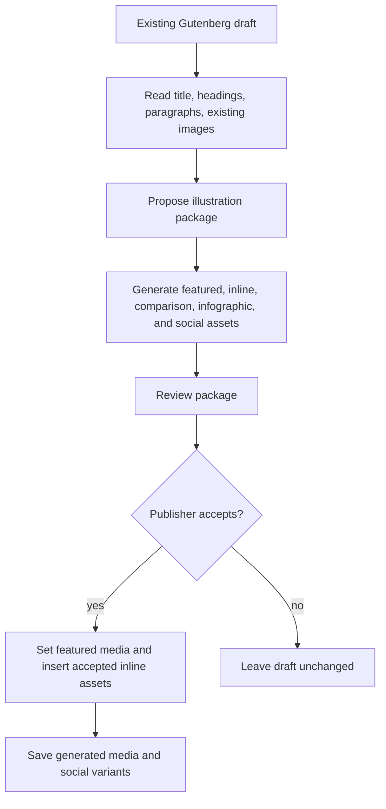
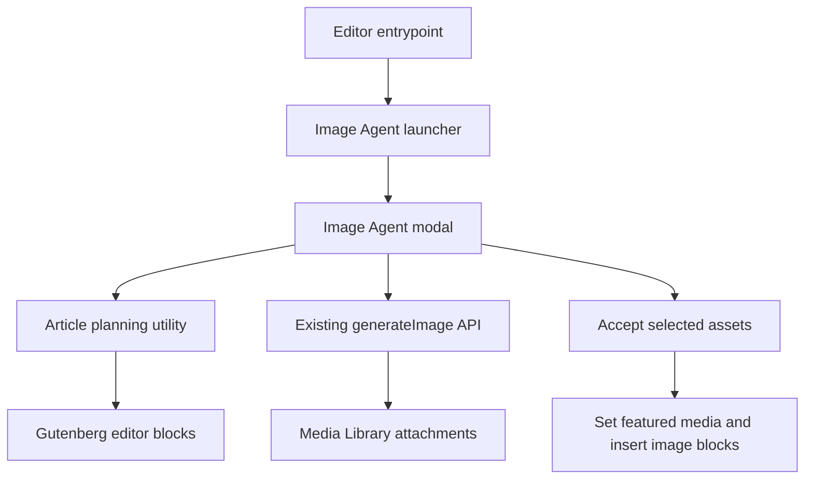

# Image Agent - Plan

## Goal Capsule

| Field | Value |
|---|---|
| Objective | Add a post-level Image Agent that reads an existing Gutenberg draft, proposes a full article illustration package, generates the assets, lets the user review them, inserts accepted article images automatically, and saves accepted social variants. |
| Product authority | Approved scope in this thread, root `AGENTS.md`, folder-specific `src/AGENTS.md`, `inc/AGENTS.md`, `tests/AGENTS.md`, existing KaiGen editor workflows. |
| Open blockers | None. |
| Execution profile | Client-side Gutenberg editor feature with existing REST image generation calls and no provider-specific server changes. |
| Stop conditions | Stop if implementation requires changing image or text model identifiers, introducing billing enforcement, or replacing existing single-image workflows. |
| Tail ownership | Regenerate committed `build/` output after `src/` changes and run the relevant unit, build, E2E, JS lint, and CSS lint gates. |

---

## Product Contract

### Summary

Image Agent turns KaiGen from a single-image prompt tool into an article illustration workflow for existing WordPress drafts.
It reads the current post, proposes where visual assets should go, generates a package of featured, inline, comparison, infographic, and social images, then lets the user accept article assets into Gutenberg and save social variants for reuse.

### Problem Frame

KaiGen already helps a user generate or regenerate one image at a time.
Publishers writing longer articles still have to identify visual opportunities, write multiple prompts, manage consistent style, set featured media, place inline images, and create social crops.
The paid value is the time saved by automating the editorial image workflow, not the raw count of generations.

### Key Decisions

- **Post-level workflow over image-block filling.** The agent reads the whole article because the core value is deciding where images belong, not filling slots the user already created.
- **Existing drafts only for v1.** The agent illustrates article content that already exists in Gutenberg and does not draft the article text.
- **Review before mutation.** The agent can generate many assets, but the user sees the proposed package before accepted media changes the post.
- **Social assets are generated, not published.** Social versions are created as part of the package and stored with the generated media, but external social posting is outside v1.
- **Single-image KaiGen remains intact.** Existing image-block generation and regeneration stay available for focused edits and fallbacks.

### Actors

- A1. **Publisher/editor:** Writes or edits the article and decides whether to accept the generated package.
- A2. **Image Agent:** Analyzes post content, proposes visual opportunities, produces generation prompts, and coordinates generated media.
- A3. **WordPress editor:** Supplies the current Gutenberg blocks and receives accepted featured and inline media updates.
- A4. **WordPress AI Client/provider stack:** Generates text planning output and image assets through configured providers.

### Requirements

**Article analysis and planning**

- R1. The Image Agent must read the current Gutenberg draft content, including title, headings, paragraphs, and existing image blocks.
- R2. The Image Agent must identify section structure from headings and surrounding text.
- R3. The Image Agent must propose image placements near relevant article sections rather than requiring the user to pre-create image blocks.
- R4. The Image Agent must produce a reviewable illustration plan before inserting generated assets into the post.

**Illustration package**

- R5. The plan must include a featured image when the article has enough content to support one.
- R6. The plan must include section illustrations for major article sections when they would improve comprehension or engagement.
- R7. The plan must include a comparison graphic when the article compares options and an infographic when the article contains lists, processes, metrics, or explanatory structure.
- R8. The plan must include three social media variants by default: square feed, landscape link preview, and vertical story crop.
- R9. The generated image prompts must preserve article meaning and use a consistent visual direction across the package.

**Review and insertion**

- R10. The user must be able to review the generated package before accepting it into the post.
- R11. The user must be able to exclude individual generated assets from the accepted package.
- R12. Accepting the package must set the featured image when a featured asset is accepted and the editor supports featured media.
- R13. Accepting the package must insert accepted inline assets into Gutenberg near their planned article positions.
- R14. Accepted social media variants must be saved to the Media Library and remain associated with the generated package.
- R15. Existing article text must not be rewritten by the Image Agent in v1.

**Compatibility and safety**

- R16. The Image Agent must not change AI model identifiers without explicit approval.
- R17. The Image Agent must use configured WordPress AI Client providers rather than adding provider-specific logic to shared code.
- R18. The existing single-image modal, image-block placeholder flow, image regeneration flow, and reference-image controls must keep working.
- R19. Empty or very short posts must show an actionable message instead of attempting a low-quality package.
- R20. Generation errors for one asset must not prevent the user from reviewing and accepting other successful assets.

### Key Flows

- F1. **Generate an article illustration package**
  - **Trigger:** The publisher opens Image Agent from the post editor on an existing draft.
  - **Actors:** A1, A2, A3, A4
  - **Steps:** The agent reads the current draft, derives the article structure, builds a proposed package, generates the selected assets, and presents the package for review.
  - **Outcome:** The publisher sees generated assets grouped by featured, inline, comparison, infographic, and social usage.
  - **Covered by:** R1, R2, R3, R4, R5, R6, R7, R8, R9

- F2. **Accept generated assets into the article**
  - **Trigger:** The publisher reviews the package and clicks Accept.
  - **Actors:** A1, A2, A3
  - **Steps:** The user excludes unwanted items if needed, accepts the remaining package, and the editor updates featured media and article blocks.
  - **Outcome:** Accepted inline assets appear in Gutenberg at planned positions, the featured image is set when supported, and social variants are saved to Media Library for later use.
  - **Covered by:** R10, R11, R12, R13, R14

- F3. **Handle partial failure**
  - **Trigger:** One or more asset generations fail while others succeed.
  - **Actors:** A1, A2, A4
  - **Steps:** The agent marks failed assets, keeps successful assets reviewable, and lets the publisher accept successful work.
  - **Outcome:** A provider or asset-level failure does not discard the whole package.
  - **Covered by:** R10, R20

### Acceptance Examples

- AE1. **Long article package**
  - **Covers R1, R2, R5, R6, R7, R8, R13.**
  - **Given:** A 2,000-word draft has a title, four major headings, and comparison-heavy body content.
  - **When:** The publisher runs Image Agent and accepts the package.
  - **Then:** The post receives a featured image, multiple inline section images near the relevant headings, a comparison graphic, an infographic, and square, landscape, and vertical social variants saved to Media Library.

- AE2. **Short draft guardrail**
  - **Covers R4, R19.**
  - **Given:** A draft contains only a title and one short paragraph.
  - **When:** The publisher opens Image Agent.
  - **Then:** The agent explains that more article content is needed instead of generating a weak package.

- AE3. **Selective accept**
  - **Covers R10, R11, R12, R13, R14.**
  - **Given:** The generated package contains a featured image, three inline images, and social variants.
  - **When:** The publisher excludes one inline image and clicks Accept.
  - **Then:** The accepted featured image and remaining inline images are applied, the excluded item is not inserted, and social variants remain available in Media Library.

- AE4. **Existing workflows remain available**
  - **Covers R18.**
  - **Given:** A user selects an image block rather than the post-level Image Agent.
  - **When:** The user opens the existing KaiGen modal.
  - **Then:** Single-image generation and regeneration behave as before.

### Success Criteria

- A publisher can go from a written draft to a reviewed article illustration package without manually creating image blocks first.
- Accepted featured and inline assets appear in the correct editor positions after one accept action.
- Square, landscape, and vertical social variants are generated and retrievable from the Media Library without posting to external services.
- Existing KaiGen single-image workflows continue to pass their current tests.
- Partial generation failures are visible and recoverable without losing successful assets.

### Scope Boundaries

- Writing the article text is outside v1.
- Billing, license enforcement, and plan-tier gates are outside this implementation unless a separate licensing surface is added later.
- External social publishing, scheduling, or campaign management is outside v1.
- Persistent multi-run campaign libraries are outside v1.
- Provider-specific request logic is outside shared/base files.
- AI model identifier changes require explicit approval and are outside this plan.

### Dependencies / Assumptions

- The current post content is available from Gutenberg editor state when the user starts Image Agent.
- The WordPress AI Client and at least one image-capable provider are configured.
- A text-capable provider is available for article analysis and package planning, or planning can fall back to deterministic article structure extraction with reduced quality.
- Featured image assignment is possible only where the current post type and editor context support featured media.
- The first useful version prioritizes image workflow automation over paid-tier enforcement.

### Sources / Research

- `README.md` describes the current product as a Gutenberg block workflow for generating and inserting AI images.
- `src/components/GenerateImageModal.js` is the current single-image generation and prompt-refinement surface.
- `src/filters/addMediaPlaceholderFilter.js` adds KaiGen to empty image block placeholders.
- `src/filters/addBlockEditFilter.js` adds regeneration and reference-image controls to existing image blocks.
- `src/api.js` contains client calls for image generation, reference images, and prompt refinement.
- `inc/class-rest-api.php` exposes the current REST routes and permission model.
- `inc/class-image-generation-service.php` coordinates WordPress AI Client image generation and media upload.
- `inc/class-prompt-refinement-service.php` shows the existing pattern for text-generation planning through the AI Client.
- `tests/e2e/image-generation.spec.ts` covers the current editor behavior that must keep working.

---

## Planning Contract

### Product Contract Preservation

Product Contract unchanged except for clarifying the default social variants as square feed, landscape link preview, and vertical story crop.

### Key Technical Decisions

- KTD1. **Use a post-level launcher mounted by the editor entrypoint.** The current repo has image-block filters but no editor plugin package dependency, so the first build should add a lightweight editor-level mount using existing WordPress packages already in use.
- KTD2. **Plan article assets on the client for v1.** Gutenberg already exposes the current block tree in editor state, and deterministic structure extraction avoids adding a fragile text-generation planning endpoint before the workflow is proven.
- KTD3. **Reuse the existing generation endpoint for every asset.** The current image generation service already handles provider choice, orientation, media upload, metadata, and errors.
- KTD4. **Insert only accepted article-facing assets.** Featured, section, comparison, and infographic assets mutate the post on accept; social variants are generated and saved to Media Library for reuse.
- KTD5. **Keep partial success reviewable.** Asset generation runs as a package sequence, but each item carries its own status so successful assets can still be accepted after a failure.

### High-Level Technical Design

The feature adds a post-level UI without replacing the existing image modal.
The planning utility converts editor blocks into article sections and asset requests.
The modal owns package generation, review state, selection state, and accept behavior.

### Implementation Constraints

- Use repo-local `src/` source files and rebuild `build/`; do not edit `build/` directly.
- Keep provider selection and orientation payloads compatible with `generateImage`.
- Use `@wordpress/data`, `@wordpress/element`, and `@wordpress/components`, which are already part of the current editor build.
- Do not add new model identifiers.
- Keep UI copy compact and workflow-oriented; avoid a marketing-style landing surface inside the editor.

---

## Implementation Units

### U1. Article planning utility

- **Goal:** Convert current Gutenberg title and block tree into a deterministic Image Agent package plan.
- **Requirements:** R1, R2, R3, R5, R6, R7, R8, R9, R19
- **Files:** Create `src/image-agent/articlePlan.js`; create `tests/unit/articlePlan.test.js`.
- **Approach:** Extract plain text from paragraph, heading, list, quote, and image blocks; group content into sections by heading; reject very short drafts; create one featured asset, up to four section illustration assets, one comparison graphic when comparison signals exist, one infographic when process/list/metric signals exist, and three social assets.
- **Test scenarios:** Short drafts return a guardrail reason; a 2,000-word-style draft with four headings returns featured, four inline illustrations, one comparison graphic, one infographic, and three social variants; section assets carry insertion anchors; social assets carry square, landscape, and portrait orientations.
- **Verification:** `npm run test:unit -- tests/unit/articlePlan.test.js`

### U2. Image Agent modal and launcher

- **Goal:** Add a post-level Image Agent UI that plans, generates, reviews, and accepts an article package.
- **Requirements:** R4, R10, R11, R15, R18, R19, R20
- **Files:** Create `src/components/ImageAgentModal.js`; create `src/image-agent/registerImageAgent.js`; modify `src/index.js`; modify `assets/kaigen-admin.css`; update `tests/unit/editorEntrypoint.test.js`; create `tests/unit/ImageAgentModal.test.js`.
- **Approach:** Mount a fixed editor-level Image Agent button from the entrypoint, open a modal, compute the plan from current editor state, render asset rows with selection controls, generate assets sequentially through `generateImage`, and preserve per-item success/error state.
- **Test scenarios:** Entrypoint imports the launcher; modal source uses `generateImage` without changing existing modal code; UI exposes Generate package and Accept controls; partial failure state remains reviewable; existing single-image modal imports remain unchanged.
- **Verification:** `npm run test:unit -- tests/unit/editorEntrypoint.test.js tests/unit/ImageAgentModal.test.js`

### U3. Accept and insert generated package

- **Goal:** Apply selected generated assets to the current post after review.
- **Requirements:** R11, R12, R13, R14, R15, R20
- **Files:** Implement in `src/components/ImageAgentModal.js`; cover with `tests/unit/ImageAgentModal.test.js`; extend `tests/e2e/image-generation.spec.ts`.
- **Approach:** Set featured media when a selected featured asset has an attachment ID; insert selected inline/comparison/infographic assets as `core/image` blocks near planned positions; leave social variants saved in Media Library without inserting them into article body; show success and error notices through the existing notices store.
- **Test scenarios:** Accept code calls the editor store for featured media; image blocks are created from generated media; social assets are not inserted into the article body; accept is disabled until at least one generated selected asset exists.
- **Verification:** `npm run test:unit -- tests/unit/ImageAgentModal.test.js`

### U4. Build and browser coverage

- **Goal:** Prove the post-level workflow works in the real editor and preserve committed build artifacts.
- **Requirements:** R1-R20
- **Files:** Modify `tests/e2e/image-generation.spec.ts`; modify `build/` via `npm run build`.
- **Approach:** Add a mocked-generation E2E path that creates a draft with multiple headings, opens Image Agent, generates the package, accepts it, and verifies featured media plus inserted image blocks while existing modal tests still pass.
- **Test scenarios:** Image Agent button appears in the post editor; a short draft displays the guardrail; a longer draft generates multiple mocked images; Accept inserts article images and sets featured media; existing single-image generation and reference flows remain covered.
- **Verification:** `npm run build`, `npm run test:unit`, `npm run test:e2e:generation`, `npm run lint:js`, `npm run lint:css`

---

## Verification Contract

| Gate | Command | Covers | Done signal |
|---|---|---|---|
| Article planning unit coverage | `npm run test:unit -- tests/unit/articlePlan.test.js` | U1 | Planning utility tests pass. |
| Image Agent source contracts | `npm run test:unit -- tests/unit/ImageAgentModal.test.js tests/unit/editorEntrypoint.test.js` | U2, U3 | Modal, launcher, and entrypoint contracts pass. |
| Full unit suite | `npm run test:unit` | U1-U3 plus existing safeguards | Jest reports all unit tests passing. |
| Build committed assets | `npm run build` | U2-U4 | `build/` regenerates without errors. |
| Browser workflow | `npm run test:e2e:generation` | U3, U4 | Playwright verifies mocked generation and editor insertion. |
| JavaScript lint | `npm run lint:js` | JS source/tests | Linter reports no JS violations. |
| CSS lint | `npm run lint:css` | UI styles | Stylelint reports no CSS violations. |

---

## Definition of Done

- Image Agent can be opened from the post editor without selecting an image block.
- The agent reads existing Gutenberg draft content and produces a package plan from title, headings, paragraphs, lists, and existing images.
- A long article can generate a featured image, section illustrations, comparison graphic, infographic asset, and square, landscape, and vertical social variants.
- The user can review generated assets, deselect individual items, and accept the remaining package.
- Accept sets featured media when possible and inserts selected article-facing assets into Gutenberg near planned positions.
- Accepted social variants are generated and saved to Media Library without external posting.
- Existing single-image KaiGen flows keep working.
- Dead-end or experimental code is removed before completion.
- `npm run build`, relevant unit tests, `npm run test:e2e:generation`, `npm run lint:js`, and `npm run lint:css` pass or any blocker is reported with command output.
