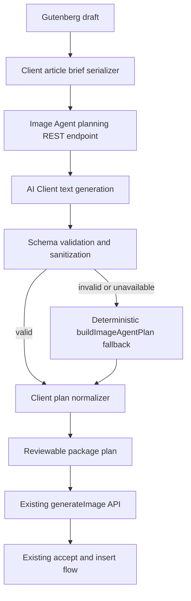
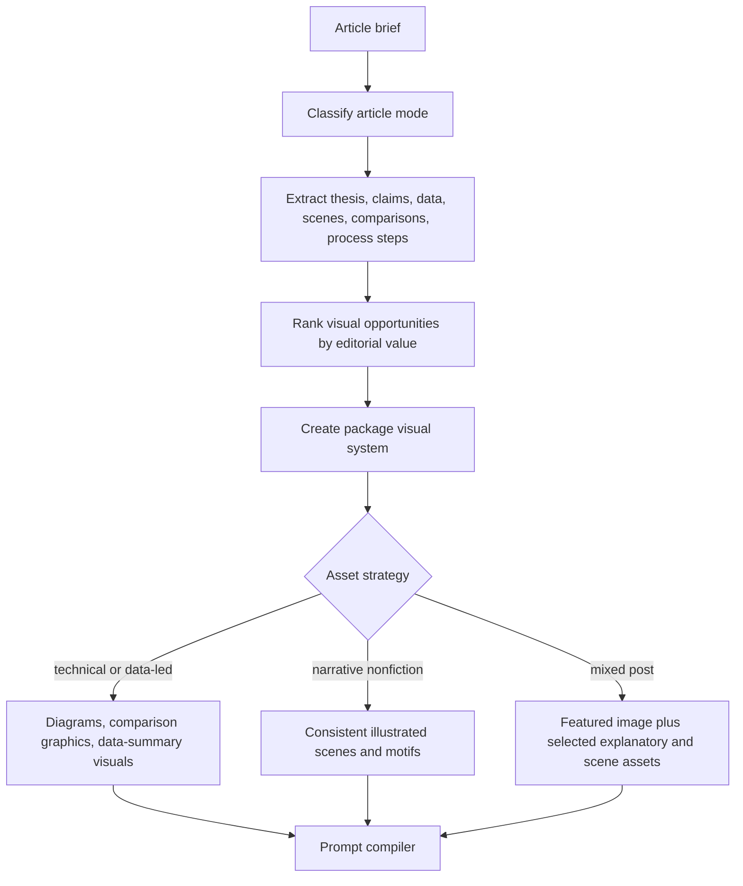

# Magical Image Agent Algorithm - Plan

## Goal Capsule

| Field | Value |
|---|---|
| Objective | Upgrade the new Image Agent from structural article heuristics into a genre-aware editorial illustrator that chooses the right visual package for the post, explains each placement, and keeps generated assets visually consistent. |
| Product authority | User request in this thread, existing Image Agent plan at `docs/plans/2026-07-04-001-feat-image-agent-plan.md`, root `AGENTS.md`, scoped `src/AGENTS.md`, `inc/AGENTS.md`, `tests/AGENTS.md`, and current branch implementation. |
| Open blockers | None for planning. The plan assumes model-backed article planning is acceptable as long as image/text model identifiers are not changed without approval. |
| Execution profile | WordPress block editor feature using a new AI Client text-planning endpoint, existing image generation endpoint, deterministic fallback planning, and committed `build/` regeneration. |
| Stop conditions | Stop if implementation requires changing image or text model identifiers, sending post content without explicit user action, provider-specific logic in shared files, or replacing the existing single-image workflows. |
| Tail ownership | After implementation, run unit, PHP/source-contract, build, E2E generation, JS lint, CSS lint, and dogfood against the provided local WordPress admin site without committing credentials. |

---

## Product Contract

### Summary

Image Agent should feel like an editorial art director for a finished post.
The user writes a post, opens Image Agent, and sees a proposed illustration package that understands whether the post is technical, explanatory, narrative nonfiction, list-based, comparison-heavy, or story-driven.
Technical posts get explanatory graphics, diagrams, comparison visuals, and infographic-style assets that reinforce the claims in the article.
Narrative nonfiction gets consistent illustrated scenes, character or setting continuity, and recurring visual motifs that make the story feel intentionally art-directed rather than assembled from unrelated prompts.

This plan builds on the existing Image Agent work instead of replacing it.
The current deterministic planner remains the fallback and source of editor anchors, while a model-backed planning layer adds editorial judgment, genre classification, visual-system direction, placement rationale, and package-level prompt strategy.

### Problem Frame

The current Image Agent planner can find headings, paragraphs, comparison signals, and data-like text, then generate one prompt per visual moment.
That is a useful workflow scaffold, but it does not yet feel magical because it does not decide what kind of visual storytelling the article needs.
It treats most paragraphs as equal visual moments, uses one broad "consistent editorial illustration style" phrase, and cannot distinguish a data-heavy technical article from a narrative essay that needs scene continuity.

The next algorithm should answer three editorial questions before it generates images:

- What is this article trying to make the reader understand or feel?
- Which visual moments will change comprehension, not just decorate the page?
- What shared art direction will make the package read as one coherent story?

### Actors

- A1. **Publisher/editor:** Writes the post and wants a polished visual package without manually art-directing every asset.
- A2. **Image Agent planner:** Reads article structure and content, classifies the article, selects visual moments, and writes asset briefs.
- A3. **Image Agent prompt compiler:** Converts asset briefs and shared style direction into generation prompts.
- A4. **WordPress editor:** Supplies the Gutenberg blocks and receives accepted media updates.
- A5. **WordPress AI Client/provider stack:** Generates structured text planning output and image assets through configured providers.

### Requirements

**Editorial understanding**

- R1. The Image Agent must classify the post into one or more article modes such as technical/explanatory, data-led, comparison, process/how-to, narrative nonfiction, profile/case study, opinion/analysis, or listicle.
- R2. The planner must extract the article thesis, primary audience, major sections, visual-worthy claims, named people/places/products, metrics, comparisons, processes, and story beats from the current Gutenberg draft.
- R3. The planner must rank visual opportunities by editorial value so it avoids over-illustrating filler paragraphs and prioritizes visuals that clarify, compare, summarize, or bring a scene to life.
- R4. Every planned asset must include a short placement rationale that explains why the image belongs at that article point.

**Genre-aware visual packages**

- R5. Technical or explanatory posts must prefer diagrams, comparison graphics, process visuals, data-summary graphics, and abstract-but-specific editorial visuals over generic illustrations.
- R6. Data-led posts must preserve the source numbers or claims in the asset brief and must not invent metrics, chart labels, or conclusions not present in the article.
- R7. Narrative nonfiction and case-study posts must identify recurring subjects, settings, time periods, moods, and scene beats so inline images feel like a consistent illustrated sequence.
- R8. The planner must choose asset count and density from article length, section importance, and genre rather than generating one image for every long paragraph.
- R9. The package must still include a featured image when there is enough content, but it should derive that image from the article's central idea rather than the first paragraph alone.

**Visual consistency and prompt quality**

- R10. The planner must produce a package-level visual system with style, medium, palette, lighting, perspective, texture, continuity anchors, and negative constraints.
- R11. Generated prompts must reuse the package visual system while tailoring subject, composition, and asset type to each placement.
- R12. Narrative packages must maintain continuity for recurring people, settings, objects, and motifs without claiming real likenesses unless the article already supplies safe public context.
- R13. Technical and infographic prompts must avoid dense readable text, fake UI, fake logos, fabricated labels, and visual claims the model cannot reliably render.
- R14. The user must be able to review the plan before generation, including genre, visual system, asset roles, placement rationale, and prompts or prompt summaries.

**Compatibility and safety**

- R15. The current deterministic `buildImageAgentPlan` behavior must remain available as a fallback when text planning is unavailable, unsupported, slow, or returns invalid JSON.
- R16. The implementation must not change existing image or text model identifiers without explicit approval.
- R17. The implementation must use WordPress AI Client providers and hooks/filters rather than provider-specific logic in shared plugin files.
- R18. Existing single-image generation, regeneration, prompt refinement, reference image, and current Image Agent accept flows must keep working.
- R19. Short or low-information posts must receive a useful guardrail and optional article-improvement guidance rather than a weak generated package.
- R20. Planning or generation failures must be asset-level where possible so the user can still review and accept successful assets.

### Key Flows

- F1. **Plan a technical article package**
  - **Trigger:** The publisher opens Image Agent on a data-heavy or explanatory draft.
  - **Actors:** A1, A2, A3, A4, A5
  - **Steps:** The client serializes the draft, the planner classifies it as technical/data-led, the planner identifies claims/processes/comparisons, the prompt compiler creates infographic and diagram briefs, and the modal shows the plan before generation.
  - **Outcome:** The package prioritizes visuals that explain the article's main ideas and preserves source claims without fabricated chart data.
  - **Covered by:** R1, R2, R3, R4, R5, R6, R8, R10, R13, R14

- F2. **Plan a narrative nonfiction package**
  - **Trigger:** The publisher opens Image Agent on a story, case study, profile, or scene-driven nonfiction post.
  - **Actors:** A1, A2, A3, A4, A5
  - **Steps:** The planner identifies narrative mode, recurring subjects/settings, story beats, and mood; it creates a visual system and scene briefs; the modal shows consistent inline illustration suggestions.
  - **Outcome:** Generated images share recognizable art direction and continuity anchors while each image illustrates a distinct story moment.
  - **Covered by:** R1, R2, R3, R4, R7, R8, R10, R11, R12, R14

- F3. **Fallback safely**
  - **Trigger:** The model-backed planner is unavailable, unsupported, invalid, or times out.
  - **Actors:** A1, A2, A4
  - **Steps:** The client falls back to deterministic planning, labels the package as basic, keeps current generation behavior available, and avoids blocking the existing workflow.
  - **Outcome:** The user still gets a usable article package and existing Image Agent tests remain meaningful.
  - **Covered by:** R15, R18, R19, R20

### Acceptance Examples

- AE1. **Technical post gets explanatory assets**
  - **Covers:** R1, R2, R3, R5, R6, R10, R13, R14
  - **Given:** A draft explains API latency, includes a three-step optimization workflow, compares two architectures, and cites a 42% latency reduction.
  - **When:** The publisher opens Image Agent.
  - **Then:** The plan classifies the post as technical/data-led, proposes a process diagram, comparison graphic, and data-summary asset, cites the relevant source sections, and avoids inventing unsupported numbers.

- AE2. **Narrative nonfiction stays visually consistent**
  - **Covers:** R1, R2, R7, R10, R11, R12, R14
  - **Given:** A draft tells a case study about a publisher, a newsroom workflow, and repeated scenes across a launch week.
  - **When:** The publisher opens Image Agent and generates the package.
  - **Then:** The inline images share medium, palette, perspective, and recurring visual motifs while each prompt targets a different story beat.

- AE3. **Planner failure falls back**
  - **Covers:** R15, R18, R19, R20
  - **Given:** The text-planning endpoint returns invalid JSON or reports unsupported text generation.
  - **When:** The publisher opens Image Agent.
  - **Then:** The modal falls back to deterministic planning, explains that advanced planning is unavailable, and still allows generation from the basic plan when the article is long enough.

- AE4. **Review happens before generation**
  - **Covers:** R4, R8, R10, R14
  - **Given:** A long post has more possible visual moments than should be generated.
  - **When:** Image Agent finishes planning.
  - **Then:** The user sees the proposed count, asset roles, placement reasons, and style direction before any image-generation requests are sent.

### Success Criteria

- The package plan visibly changes by article genre instead of returning the same asset pattern for every long draft.
- Technical posts generate fewer generic illustrations and more explanation-oriented briefs with traceable claims.
- Narrative nonfiction packages reuse a shared visual system and continuity anchors across all illustration prompts.
- The modal makes the agent's editorial choices reviewable before generation.
- Existing deterministic planning, single-image modal, prompt refinement, reference-image, generation, and insertion flows keep passing.
- Browser QA confirms the workflow on the provided local WordPress site at `http://localhost:8881/wp-admin/` using the login details from the current thread, without storing those details in the repo.

### Scope Boundaries

- This plan improves article illustration planning and prompt strategy; it does not draft or rewrite article text.
- This plan does not add billing, entitlement checks, or paid-tier enforcement.
- This plan does not change image or text model identifiers.
- This plan does not add provider-specific prompt payload logic.
- This plan does not promise exact chart or text rendering inside generated pixels; source numbers should be preserved in briefs, captions, alt text, and prompts, with dense text avoided in image prompts.
- This plan does not publish social assets externally.

### Assumptions

- The advanced planner can send the current article content to a configured text-capable AI Client provider only after the user explicitly opens or runs Image Agent.
- A structured model-backed planner is acceptable for the magical experience, with deterministic planning retained as a fallback.
- The first implementation should improve brief quality and prompt consistency before adding a separate deterministic chart-rendering engine.
- The existing `sourceImageIds` path may be used later for reference-based style consistency, but this plan does not require it for correctness because provider support varies.

### Sources / Research

- `docs/plans/2026-07-04-001-feat-image-agent-plan.md` defines the current Image Agent scope, flows, and deterministic fallback expectations.
- `src/image-agent/articlePlan.js` currently extracts sections and paragraph-level visual moments with comparison and infographic regexes.
- `src/components/ImageAgentModal.js` currently computes a plan in the editor, generates selected assets through `generateImage`, and inserts accepted featured/body assets.
- `src/api.js` owns client REST calls for image generation and prompt refinement.
- `inc/class-prompt-refinement-service.php` shows the existing AI Client text-generation pattern, JSON response validation, and model-preference filter approach.
- `inc/class-rest-api.php` owns route registration and permission checks.
- `tests/unit/articlePlan.test.js` and `tests/e2e/image-generation.spec.ts` cover the current source-contract and mocked generation behavior that must remain green.

---

## Planning Contract

### Product Contract Preservation

This plan extends the July 4 Image Agent plan rather than replacing it.
The existing post-level launcher, review-before-mutation posture, generation endpoint reuse, and accept/insert workflow remain intact.
The main change is that article planning becomes a two-layer system: deterministic extraction and fallback stay local, while a model-backed editorial planner provides genre, visual-system, and asset-brief judgment.

### Key Technical Decisions

- KTD1. **Add model-backed planning as a separate REST endpoint.** Image generation stays on `/kaigen/v1/generate-image`; article planning gets its own endpoint so planning failures do not destabilize media upload or existing single-image generation.
- KTD2. **Client-supplied source segments remain authoritative for placement.** The model may choose and describe visual moments, but it must reference client-generated segment IDs so Gutenberg insertion anchors come from trusted editor state.
- KTD3. **Use structured JSON with strict sanitization.** The planning service returns a schema with article mode, visual system, assets, rationales, source refs, and safety notes; invalid or incomplete responses fall back to deterministic planning.
- KTD4. **Compile prompts deterministically from structured briefs.** The model should produce editorial briefs, not final unbounded prompts; the client composes final prompts from the shared visual system, asset role, source context, and safety constraints.
- KTD5. **Treat exact infographics as a content-safety constraint.** For data-heavy posts, the planner preserves source claims and proposes clear explanatory graphics, but prompts avoid dense text or fabricated labels until a future deterministic chart renderer exists.
- KTD6. **Keep style consistency package-level.** The visual system is attached to every prompt; narrative packages also carry continuity anchors for recurring subjects, settings, motifs, and mood.
- KTD7. **Do not introduce new model identifiers.** If planning needs model preference behavior, use provider auto-selection or an explicit filter without adding or changing default model IDs.

### High-Level Technical Design

### Implementation Constraints

- Keep source changes in `src/` and `inc/`; regenerate `build/` with `npm run build`.
- Follow WordPress REST permission and sanitization patterns from `inc/class-rest-api.php` and `inc/class-prompt-refinement-service.php`.
- Do not persist the provided local test credentials in files, screenshots, or reports.
- Keep all file paths in tests and docs repo-relative.
- Keep the current modal and deterministic planner available while adding the advanced path incrementally.

### Risks & Mitigations

- **Risk: Model output drifts from the article.** Require source segment IDs, sanitize every field, cap asset count, and fall back when references do not match the submitted brief.
- **Risk: Generated infographic text is inaccurate or illegible.** Preserve data in brief metadata, captions, and alt text; prompt for visual structure with minimal text; defer exact chart rendering to a later renderer.
- **Risk: Planning slows down the workflow.** Show planning progress, allow fallback, and keep deterministic planning available when text planning is unsupported.
- **Risk: More prompts create more provider failures.** Keep per-asset status and partial success behavior from the current modal.
- **Risk: Source-contract tests miss real behavior.** Add behavior-level unit tests for the planner and E2E assertions for genre-specific planning outcomes.

---

## Implementation Units

### U1. Article brief serializer and source map

- **Goal:** Convert Gutenberg editor state into a structured article brief that both deterministic and model-backed planners can consume.
- **Requirements:** R2, R3, R6, R15, R19
- **Dependencies:** None.
- **Files:** `src/image-agent/articleBrief.js`, `src/image-agent/articlePlan.js`, `tests/unit/articleBrief.test.js`, `tests/unit/articlePlan.test.js`
- **Approach:** Extract title, excerpt, headings, paragraphs, lists, quotes, tables when represented in blocks, existing image captions, word counts, section nesting, segment IDs, client IDs, and source snippets. Mark candidate signals for metrics, comparisons, process steps, named entities, and scene details. Keep `clientId` and insertion anchors client-only so the server never invents Gutenberg placement.
- **Patterns to follow:** Current `stripMarkup`, `getBlockText`, section extraction, and placement behavior in `src/image-agent/articlePlan.js`.
- **Test scenarios:** A technical draft produces metric, process, and comparison signals with stable source segment IDs; a narrative draft produces scene/entity signals without comparison inflation; nested/list content is included; short drafts still return the existing guardrail; source segments retain the client IDs needed for insertion.
- **Verification:** `npm run test:unit -- tests/unit/articleBrief.test.js tests/unit/articlePlan.test.js`

### U2. Model-backed Image Agent planning endpoint

- **Goal:** Add a server endpoint that turns an article brief into structured editorial planning JSON through the WordPress AI Client.
- **Requirements:** R1, R2, R3, R4, R5, R6, R7, R8, R9, R10, R16, R17, R20
- **Dependencies:** U1.
- **Files:** `inc/class-image-agent-planning-service.php`, `inc/class-rest-api.php`, `kaigen.php`, `src/api.js`, `tests/unit/imageAgentPlanningApi.test.js`, `tests/e2e/fixtures/mu-plugins/kaigen-e2e-generation-mock.php`
- **Approach:** Register `POST /kaigen/v1/image-agent-plan` with `upload_files` permission, sanitized article brief input, and a JSON response schema. The service asks for article modes, thesis, visual system, ranked asset briefs, source segment refs, placement rationales, safety notes, and suggested captions/alt text. It validates source refs against submitted segment IDs, caps asset count, strips unsupported fields, and returns a typed error when text generation is unavailable.
- **Execution note:** Characterize the current prompt-refinement text-generation pattern before adding the new service so route registration, JSON decoding, and unsupported-provider handling remain consistent.
- **Patterns to follow:** `inc/class-prompt-refinement-service.php` for `wp_ai_client_prompt`, `as_json_response`, `is_supported_for_text_generation`, response decoding, and filterable model behavior; `inc/class-rest-api.php` for route args and permissions.
- **Test scenarios:** Route is registered with sanitized input and the existing permission callback; service uses AI Client text generation and JSON schema validation; invalid JSON returns a typed error; unknown source segment refs are removed or cause fallback-safe errors; no new hardcoded model identifiers are introduced.
- **Verification:** `npm run test:unit -- tests/unit/imageAgentPlanningApi.test.js`

### U3. Plan normalization, fallback, and prompt compiler

- **Goal:** Merge model-backed asset briefs with trusted client source maps and compile final image prompts from structured planning data.
- **Requirements:** R3, R4, R5, R6, R7, R8, R10, R11, R12, R13, R15, R20
- **Dependencies:** U1, U2.
- **Files:** `src/image-agent/articlePlan.js`, `src/image-agent/promptCompiler.js`, `tests/unit/articlePlan.test.js`, `tests/unit/promptCompiler.test.js`
- **Approach:** Add an async advanced planning path that calls the endpoint, normalizes valid responses, and falls back to deterministic planning on failure. Keep final prompt construction local: shared visual system plus asset role plus source-specific context plus negative constraints. Preserve deterministic `buildImageAgentPlan` as the fallback export or wrap it behind a new planner that can return either advanced or basic plans.
- **Technical design:** Directionally, normalized assets should carry `kind`, `role`, `sourceSegmentIds`, `placement`, `rationale`, `orientation`, `insertIntoPost`, `selected`, `visualSystem`, `continuityAnchors`, `caption`, `alt`, and compiled `prompt`. Exact property names may adjust during implementation as long as tests assert the contract.
- **Patterns to follow:** Current asset shape in `src/image-agent/articlePlan.js` and generation call shape in `src/components/ImageAgentModal.js`.
- **Test scenarios:** Valid technical planner JSON yields diagram/comparison/infographic assets with source-backed rationales; valid narrative planner JSON yields scene assets sharing style and continuity anchors; invalid endpoint response falls back to deterministic planning with a visible basic-plan note; prompt compiler includes shared style in every prompt; data prompts preserve article numbers but include constraints against dense text and fabricated claims.
- **Verification:** `npm run test:unit -- tests/unit/articlePlan.test.js tests/unit/promptCompiler.test.js`

### U4. Genre-aware review experience in the Image Agent modal

- **Goal:** Make the planning stage reviewable before generation so the user sees why the package is being proposed.
- **Requirements:** R4, R8, R10, R14, R18, R19, R20
- **Dependencies:** U1, U2, U3.
- **Files:** `src/components/ImageAgentModal.js`, `assets/kaigen-admin.css`, `tests/unit/ImageAgentModal.test.js`, `tests/e2e/image-generation.spec.ts`
- **Approach:** Split the modal into planning, review, generating, and accept states. On open, build the article brief and request the advanced plan. Show article mode, asset count, visual system summary, each asset's role, placement rationale, selected state, and generated status. Keep Generate package disabled until there is a valid plan; show a fallback/basic-plan notice when deterministic planning is used.
- **Patterns to follow:** Existing WordPress `Button`, `CheckboxControl`, `Spinner`, `Modal`, and notice usage in `src/components/ImageAgentModal.js`; current `.kaigen-image-agent__asset` styling in `assets/kaigen-admin.css`.
- **Test scenarios:** Modal calls the advanced planner before generation; review state displays article mode and rationale; fallback notice appears when advanced planning fails; Generate package still calls `generateImage` with compiled prompts and orientations; existing accept behavior for featured and body assets remains intact.
- **Verification:** `npm run test:unit -- tests/unit/ImageAgentModal.test.js`

### U5. Consistency and metadata through generation and accept

- **Goal:** Carry the editorial plan through generated media so accepted images have useful alt text, captions, and package context.
- **Requirements:** R10, R11, R12, R13, R14, R18, R20
- **Dependencies:** U3, U4.
- **Files:** `src/components/ImageAgentModal.js`, `src/api.js`, `tests/unit/ImageAgentModal.test.js`, `tests/unit/api.test.js`
- **Approach:** Use the compiled prompt for generation while preserving planner-provided alt text, caption, role, and rationale on the client asset. When inserting image blocks, use planner alt/caption when available instead of raw prompt text. Do not alter the generation endpoint unless attachment metadata needs an additive optional field; prefer client-side block attributes for this pass.
- **Patterns to follow:** Existing `generateImage` normalization in `src/api.js` and block creation in `src/components/ImageAgentModal.js`.
- **Test scenarios:** Generated assets retain planner metadata after media response; inserted image blocks use planner alt/caption; social or non-inserted assets remain generated but do not enter the article body; failed assets keep their rationale visible for regeneration or deselection.
- **Verification:** `npm run test:unit -- tests/unit/ImageAgentModal.test.js tests/unit/api.test.js`

### U6. E2E, mocked planner fixture, and dogfood coverage

- **Goal:** Prove the magical algorithm behaves differently for technical and narrative drafts in the real editor without real provider calls.
- **Requirements:** R1-R20
- **Dependencies:** U1-U5.
- **Files:** `tests/e2e/image-generation.spec.ts`, `tests/e2e/fixtures/mu-plugins/kaigen-e2e-generation-mock.php`, `build/`
- **Approach:** Extend the mocked E2E plugin to handle `/kaigen/v1/image-agent-plan` with deterministic technical and narrative responses based on submitted article text. Add one technical article test and one narrative nonfiction test. Verify the visible plan review, generation count, inserted image count, featured media, fallback behavior, and existing single-image generation path. After automated tests pass, run `ce-dogfood` on the implemented branch against `http://localhost:8881/wp-admin/` using the provided login details from the thread and write its report under `docs/dogfood-reports/`.
- **Test scenarios:** Technical draft displays technical/data-led mode, process/comparison/data-summary roles, and source-backed rationales; narrative draft displays narrative mode and repeated visual-system language; mocked advanced planner failure displays the fallback notice and still generates from the deterministic plan; accepting a package inserts images near the intended paragraphs; existing `@generation inserts a mocked generated image into an empty image block` remains green.
- **Verification:** `npm run build`, `npm run test:unit`, `npm run test:e2e:generation`, `npm run lint:js`, `npm run lint:css`, then dogfood the branch with the provided local WordPress admin site.

---

## Verification Contract

| Gate | Command | Covers | Done signal |
|---|---|---|---|
| Article brief and fallback planner units | `npm run test:unit -- tests/unit/articleBrief.test.js tests/unit/articlePlan.test.js` | U1, U3 | Brief extraction, fallback planning, genre signals, and source anchors pass. |
| Planning endpoint source contracts | `npm run test:unit -- tests/unit/imageAgentPlanningApi.test.js` | U2 | REST route, permission, sanitization, AI Client JSON planning, and no-new-model-ID assertions pass. |
| Prompt compiler units | `npm run test:unit -- tests/unit/promptCompiler.test.js` | U3 | Technical, data-led, and narrative prompts include the right shared system and safety constraints. |
| Modal and API units | `npm run test:unit -- tests/unit/ImageAgentModal.test.js tests/unit/api.test.js` | U4, U5 | Review states, metadata carry-through, generation calls, and accept behavior pass. |
| Full unit suite | `npm run test:unit` | U1-U5 plus existing safeguards | Jest reports all unit tests passing. |
| Build committed assets | `npm run build` | U4-U6 | `build/` regenerates without errors. |
| Mocked browser workflow | `npm run test:e2e:generation` | U4-U6 | Playwright verifies technical, narrative, fallback, and existing generation flows. |
| JavaScript lint | `npm run lint:js` | JS source/tests | Linter reports no JS violations. |
| CSS lint | `npm run lint:css` | UI styles | Stylelint reports no CSS violations. |
| Manual dogfood | `ce-dogfood` workflow against `http://localhost:8881/wp-admin/` | Full user experience | Dogfood report records flows, matrix, paper cuts, fixes, and readiness verdict. |

---

## Definition of Done

- Image Agent creates an advanced article plan through a model-backed AI Client planning endpoint when available.
- The deterministic planner remains available and visibly used as fallback when advanced planning fails.
- Technical or data-led posts receive explanation-oriented asset briefs instead of generic section illustrations.
- Narrative nonfiction posts receive a shared visual system and continuity anchors across scene illustrations.
- The user can review article mode, visual system, asset roles, placement rationales, and selected assets before any image generation request is sent.
- Generated prompts are compiled from structured briefs and include package-level style consistency and safety constraints.
- Data-heavy prompts preserve source claims and avoid fabricated numbers, fake labels, and dense unreadable text.
- Accepted images use planner-provided alt text and captions where available.
- Existing single-image generation, prompt refinement, reference-image, current Image Agent generation, and accept flows remain intact.
- `build/` is regenerated from `src/`.
- Relevant unit tests, full unit suite, build, `npm run test:e2e:generation`, JS lint, CSS lint, and dogfood pass or blockers are reported with concrete command output and report paths.
- Dead-end or experimental code from rejected planning approaches is removed before completion.
